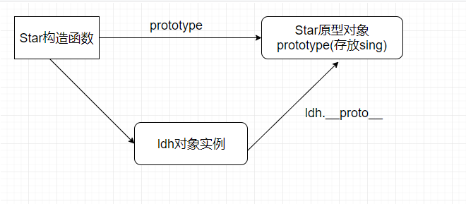

### 一、创建对象的方式
#### 1. 通过对象字面量
```javascript
var obj1 = {
    name: 'zhangsan',
    age: 18
}
```
#### 2. 通过new Object()
```javascript
var obj2 = new Object();
obj2.name = "zhangsan";
obj2.age = 18;
```
#### 3. 利用构造函数创建对象
```javascript
function Star(name, age) {
    this.name = name;
    this.age = age;
    this.sing = function() {
        console.log('我要唱歌');
    }
}

var ldh = new Star('刘德华', 18);
var zxy = new Star('张学友', 22);
console.log(ldh)
ldh.sing(); //我要唱歌
zxy.sing(); //我要唱歌
```

### 二、构造函数
当任意一个普通函数用于创建一‘类’对象时，它就被称作构造函数，或构造器。构造函数是一种特殊的函数，主要用来初始化对象，即为对象成员变量赋初始值，它总于new一起使用，我们可以把对象中一些公共的属性和方法抽取出来，然后封装到这个函数里面。
```javascript
function Star(name, age) {
    // // 构造函数中的属性和方法我们称为成员, 成员可以添加
    this.name = name;
    this.age = age;
    this.sing = function() {
        console.log('我要唱歌');
    }
}
```
>只要被new关键字调用构造函数所生成的对象就叫对象实例
```javascript
var ldh = new Star('刘德华', 18);
```
>(1)实例成员就是构造函数内部通过this添加的成员，name、age、sing就是实例成员，实例成员只能通过实例化的对象来访问，不能通过构造函数来访问实例成员(Star.name)
```javascript
console.log(ldh)
ldh.sing();
```
(2)静态成员就是在构造函数本身上添加的成员，sex就是静态成员，静态成员只能通过构造函数来访问(Star.sex)，不能通过对象来访问
```javascript
Star.sex = "男";
console.log(Star.sex) // 男
console.log(ldh.sex) // undefined

var zxy = new Star('张学友', 19);
console.log(zxy)
```

>new在执行时会做的四件事情：
(1)在内存中创建一个新的空对象；
(2)让this指向这个空对象；
(3)执行构造函数里面的代码，给这个新对象添加属性和方法；
(4)返回这个新对象(所以构造函数里面不需要return)

构造函数存在浪费内存的问题，每实例化一个对象，就会创建一个新的内存空间，如果实例的对象多，就会占用较多的内存。


### 三、构造函数原型prototype
构造函数通过原型分配的函数是所有对象所共享的。
js规定，每一个构造函数都有一个prototype属性，指向另一个对象。
prototype就是通过调用构造函数而创建的那个对象实例的原型对象，这个prototype就是一个对象，这个对象的所有属性和方法，都会被构造函数所拥有。

我们可以把那些不变的方法，直接定义在prototype对象上，这样所有对象的实例就可以共享这些方法。
```javascript
function Student(name, age) {
    this.name = name;
    this.age = age;
}

Student.prototype.study = function() {
    console.log('学习js中')
}

var zs = new Student('张三', 18);
var ls = new Student('李四', 19);

console.log(zs.study() === ls.study());//true
``` 
>上面的代码可以看出zs和ls实现了方法的共享

一般情况下，我们的公共属性定义到构造函数里面，公共的方法我们放到原型对象身上。

**原型规则和示例**
(1) 所有的引用类型（数组、对象、函数）都具有对象特性，即可自由扩展属性（null除外）
```javascript
var arr = [];
arr.a = 100;

var obj = {};
obj.a = 100;

function fn() {}
fn.a = 100;
```

(2) 所有的引用类型（数组、对象、函数）都有一个__proto__(隐式原型)属性，属性值是一个普通的对象
```javascript
console.log(obj.__proto__);
console.log(arr.__proto__);
console.log(fn.__proto__);
```
(3) 所有的函数，都有一个prototype(显式原型)属性，属性值也是一个普通的对象
```javascript
console.log(fn.prototype);
```
(4) 所有的引用类型（数组、对象、函数）__proto__属性值指向它的构造函数的prototype属性值
```javascript
console.log(obj.__proto__ === Object.prototype); 
```
(5) 试图得到一个对象的某个属性时，如果这个对象本身没有这个属性，那么会去它的__proto__（即它的构造函数的prototype）中寻找。
```javascript
function Person(name){
    this.name = name;
}

Person.prototype.age = 12;

var person = new Person('bob');
console.log(person.age); // 12
```

### 四、对象原型__proto__
对象都会有一个属性__proto__指向构造函数的prototype原型对象，之所以我们对象可以使用构造函数prototype原型对象的属性和方法，就是因为对象有__proto__原型的存在。

```javascript
function Coder(name, age) {
    this.name = name;
    this.age = age
}

Coder.prototype.codeing = function() {
    console.log('我是程序猿')
}

var yyx = new Coder('尤雨溪', 35);
var zxl = new Coder('张小龙', 40)

yyx.codeing();
console.log(yyx); // 对象身上系统自己添加一个 __proto__ 指向我们构造函数的原型对象 prototype
console.log(yyx.__proto__ === Star.prototype); //true
```
>方法的查找规则: 
首先先看yyx 对象身上是否有 codeing 方法,如果有就执行这个对象上的codeing；
如果没有codeing 这个方法,因为有__proto__ 的存在,就去构造函数原型对象prototype身上去查找sing这个方法。

__proto__对象原型和原型对象prototype是等价的；
 __proto__对象原型的意义就在于为对象的查找机制提供一个方向，或者说一条路线，但是它是一个非标准属性，因此实际开发中，不可以使用这个属性，它只是内部指向原型对象prototype




### 五、constructor构造函数
对象原型（__proto__）和构造函数（prototype）原型对象里面都有一个属性constructor属性，constructor我们称为构造函数，因为它指回构造函数本身。
```javascript
function Animals(type, color) { 
    this.type = type;
    this.color = color;
}
// 很多情况下,我们需要手动的利用constructor 这个属性指回 原来的构造函数
//  Animals.prototype.run = function(){
//      console.log('我要奔跑');
//  }
//  Animals.prototype.prey = function(){
//      console.log('我会捕食');
//  }

Animals.prototype = {
// 如果修改了原来的原型对象，给原型对象赋值的是一个对象，则必须手动利用 constructor 指回原来的构造函数
    constructor: Animals,
    run:function(){
        console.log('我要奔跑');
    },
    prey:function(){
        console.log('我会捕食');
    }
}

var tiger = new Animals('老虎', '浅黄色');
var lion = new Animals('狮子', '棕色');
console.log(Animals.prototype);
console.log(lion.__proto__);
console.log(Animals.prototype.constructor);//Animals构造函数
console.log(lion.__proto__.constructor);//Animals构造函数
```
>constructor 主要用于记录该对象引用于哪个构造函数，它可以让原型对象重新指向原来的构造函数。

一般情况下，对象的方法都在构造函数的原型对象中设置。如果有多个对象的方法，我们可以给原型对象采取对象形式赋值，但是这样就会覆盖构造函数原型对象原来的内容，这样修改后的原型对象 constructor 就不再指向当前构造函数了。此时，我们可以在修改后的原型对象中，添加一个 constructor 指向原来的构造函数。

### 六、 构造函数、实例、原型对象三例者之间的关系


### 七、原型链
```javascript
function Star(uname, age) {
    this.uname = uname;
    this.age = age;
}
Star.prototype.sing = function() {
    console.log('我会唱歌');
}
var ldh = new Star('刘德华', 18);
// 1. 只要是对象就有__proto__ 原型, 指向原型对象
console.log(Star.prototype);
console.log(Star.prototype.__proto__ === Object.prototype);
// 2.我们Star原型对象里面的__proto__原型指向的是 Object.prototype
console.log(Object.prototype.__proto__);
// 3. 我们Object.prototype原型对象里面的__proto__原型  指向为 null
```

